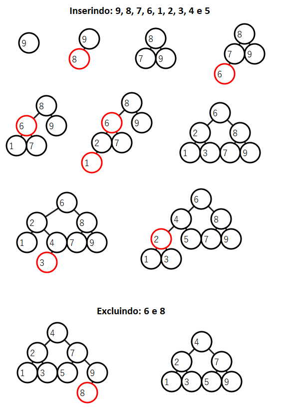
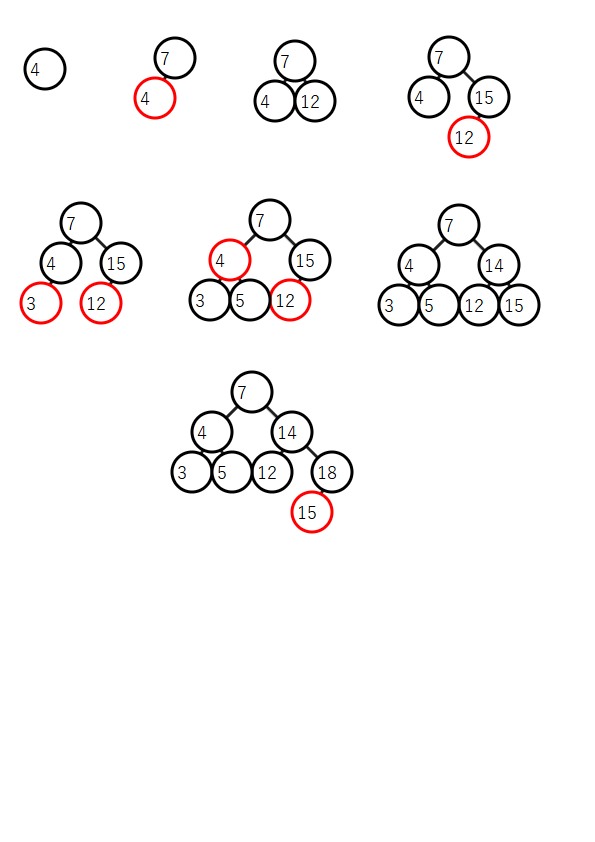
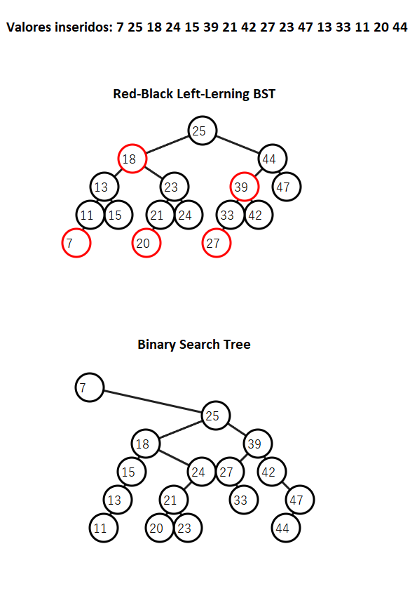
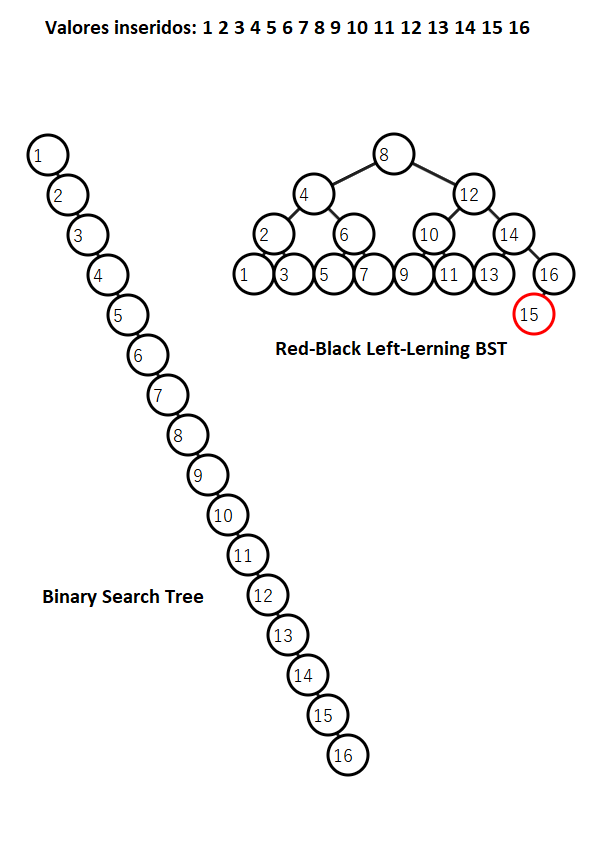

### EXERCÍCIO 1
Árvore após inserções e exclusões:



### EXERCÍCIO 2
Árvore após inserções:



### EXERCÍCIO 3

Para este exercício, utilizei o R para gerar um sample de 16 valores aleatórios entre 1 e 50, da seguinte forma:

```r
valores_aleatorios <- sample(1:50, 16)
```
A saída do código foi:

>7 25 18 24 15 39 21 42 27 23 47 13 33 11 20 44

Após isso, realizei o desenho as árvores e estes foram os resultados:



Podemos observar que as duas ficam com uma diferença pequena, de apenas 1 de altura, mas dependendo dos valores inseridos, a altura pode se diferir muito mais.

Por exemplo, veja se inserirmos valores de 1 a 16 em sequência:



A Árvore Rubro-Negra Esquerdista teve melhor desempenho para essa inserção de valores.

### EXERCÍCIO 4
Função para cálculo da altura total da árvore (linha 169 do código):
```c
// 4.1) Altura total da árvore
int altura_total(p_no raiz) {
    if (!raiz) return 0;
    int altura_esq = altura_total(raiz->esq);
    int altura_dir = altura_total(raiz->dir);
    return 1 + (altura_esq > altura_dir ? altura_esq : altura_dir); // Retorna o maior ramo
}
```

Função para cálculo da altura "negra" da árvore (linha 177 do código):
```c
// 4.2) Altura negra da árvore
int altura_negra(p_no raiz) {
    if (!raiz) return 0;
    int altura_esq = altura_negra(raiz->esq);
    int altura_dir = altura_negra(raiz->dir);
    return (raiz->cor == PRETO ? 1 : 0) + (altura_esq > altura_dir ? altura_esq : altura_dir); // Retorna o maior ramo
}
```

### EXERCÍCIO 5
O número mínimo de links rubros é 0, pois a árvore pode ser completamente preta, sem a necessidade de nós vermelhos para manter o balanceamento.

O número máximo de links rubros é de N/2, pois, no pior caso, metade dos nós podem ser vermelhos, desde que não sejam consecutivos, garantindo o correto cumprimento das regras da Árvore Red-Black Esquerdista.

### EXERCÍCIO 6
Função para cálculo do total de nós pretos da árvore (linha 185 do código):
```c
// 6) Quantidade de nós pretos na árvore
int Q_pretos(p_no raiz){
    if(!raiz) return 0;
    return Q_pretos(raiz->esq) + Q_pretos(raiz->dir) + (raiz->cor == PRETO ? 1 : 0);
}
```

### EXERCÍCIO 7
Função para cálculo do total de nós vermelhos da árvore (linha 191 do código):
```c
// 7) Quantidade de nós vermelhos na árvore
int Q_vermelhos(p_no raiz){
    if(!raiz) return 0;
    return Q_vermelhos(raiz->esq) + Q_vermelhos(raiz->dir) + (raiz->cor == VERMELHO ? 1 : 0);
}
```